# Sendline

A production-style email scheduler: schedule campaigns from a dashboard, send them later through Ethereal SMTP, and keep hourly limits and per-sender pacing in place under load, across restarts and across several worker processes.

**Stack:** TypeScript · Express · BullMQ + Redis · PostgreSQL · Elasticsearch · Nodemailer (Ethereal) · React + Vite + Tailwind · TanStack Query

```
┌──────────── Browser (React) ────────────┐      same origin: /api /auth /admin proxied
│ Login · Scheduled · Sent · Compose · …  │─────────────────────────────┐
└─────────────────────────────────────────┘                             ▼
                                   ┌──────────────── Express API ─────────────────┐
                                   │ Google OIDC (PKCE) · Slack OAuth · REST       │
 POST /api/campaigns ─────────────▶│ 1. validate + dedupe recipients               │
                                   │ 2. ONE Postgres tx: campaign + N email rows   │──▶ PostgreSQL (durable record)  
                                   │ 3. addBulk delayed jobs, jobId = email id     │──▶ Redis / BullMQ (timers)
                                   │ 4. bulk-index for search                      │──▶ Elasticsearch
                                   └───────────────────────────────────────────────┘
                                   ┌────────────── BullMQ worker(s) ───────────────┐
      delayed job fires ──────────▶│ skip if already sent/failed/cancelled         │
                                   │ slot ledger (Lua, atomic): quota + pacing     │──▶ Slack alert queue ─▶ webhook
                                   │   not our turn → move job to its exact slot   │
                                   │ claim row (UPDATE … WHERE status=scheduled)   │
                                   │ write-ahead marker → SMTP → mark sent         │──▶ Ethereal SMTP
                                   └───────────────────────────────────────────────┘
```

## Screenshots

All screenshots are in [`ss/`](ss/). Each screen has a light and a dark (black) version.

| | Light | Dark |
|---|---|---|
| Login (Google OAuth) | 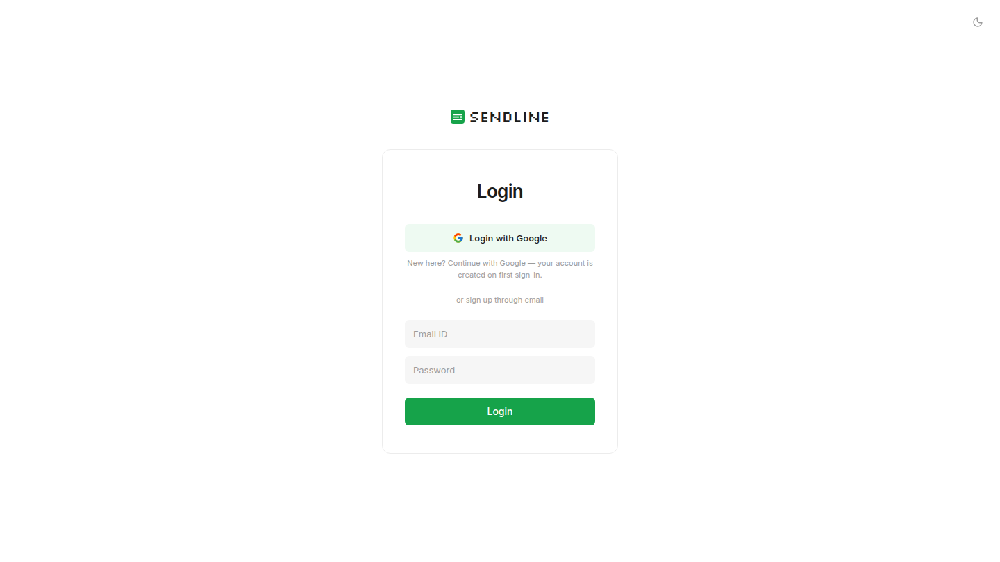 | 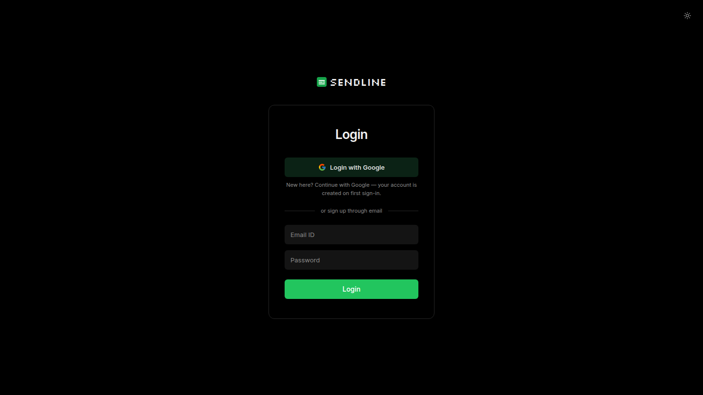 |
| Scheduled: timed and **deferred** (hourly limit) pills | 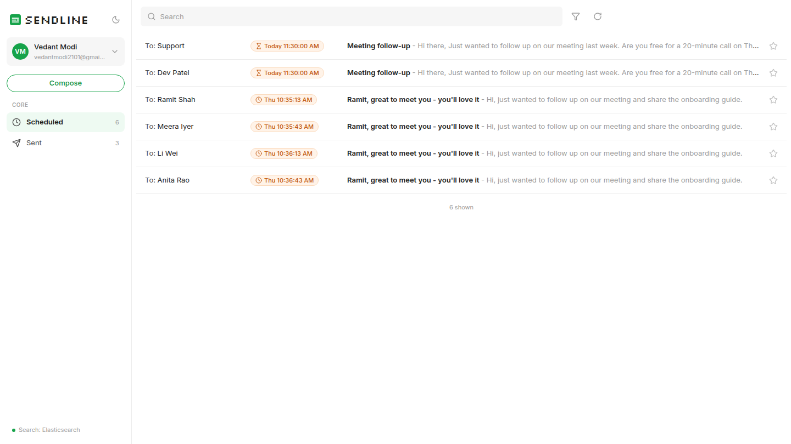 | 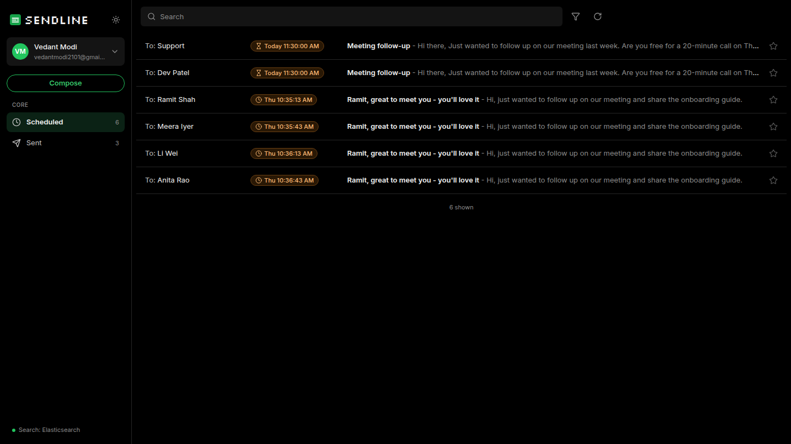 |
| Sent | 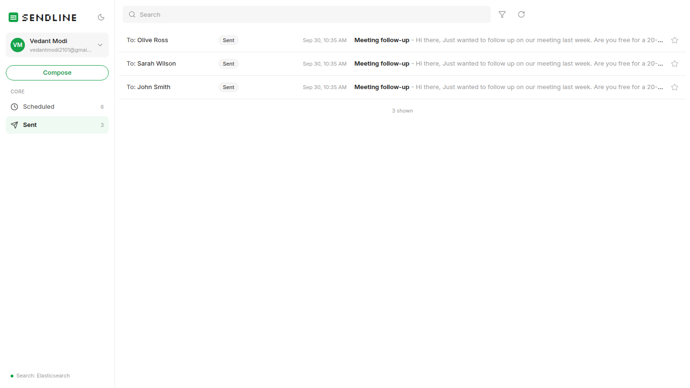 | 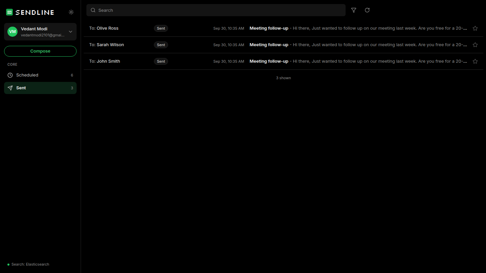 |
| Email detail + delivery metadata | 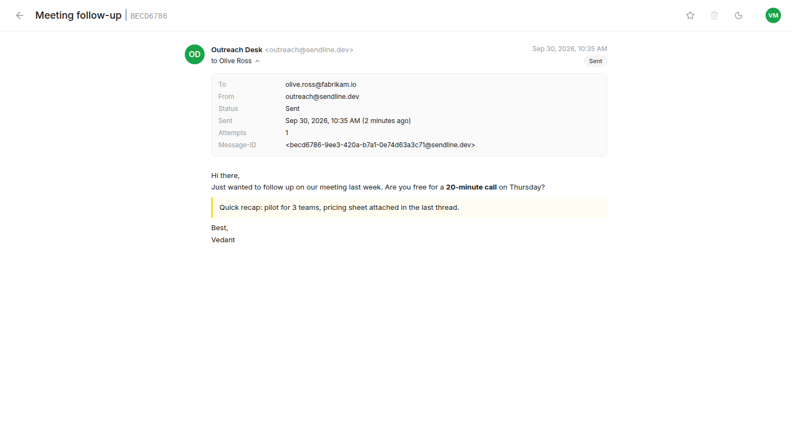 | 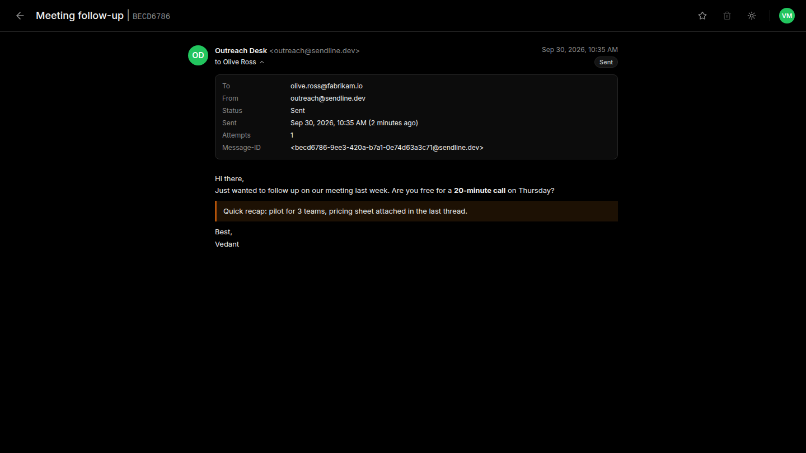 |
| Compose: CSV upload with detected-address count | 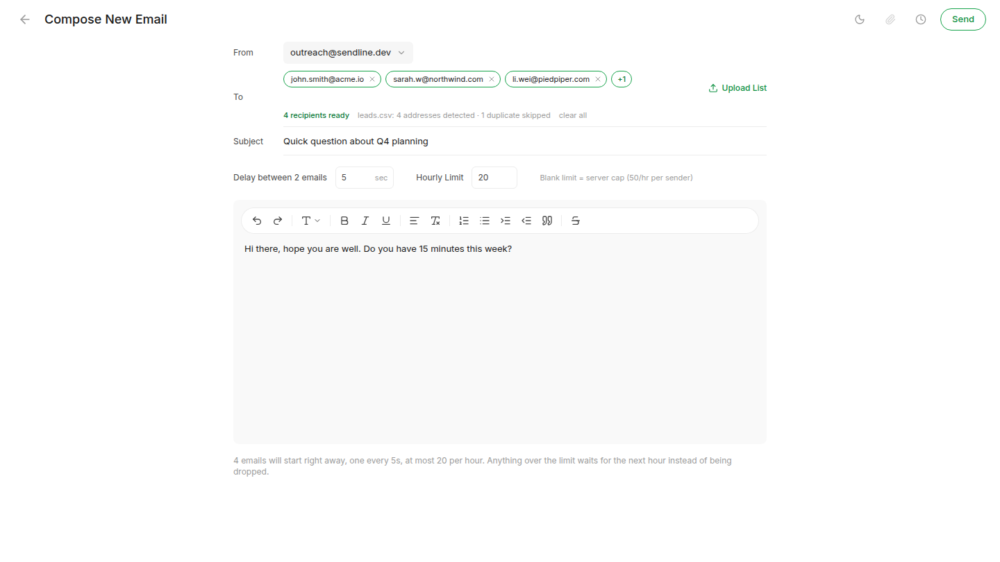 | 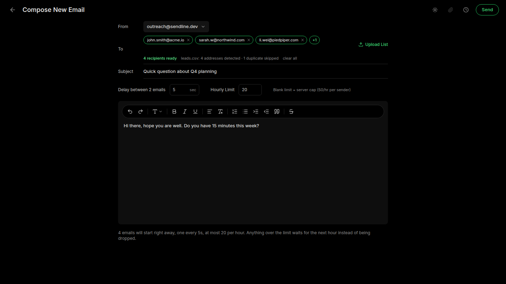 |
| Compose: Send Later picker | 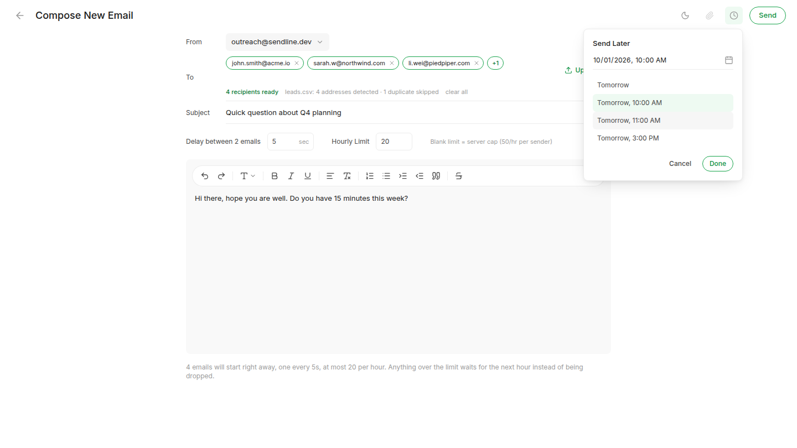 | 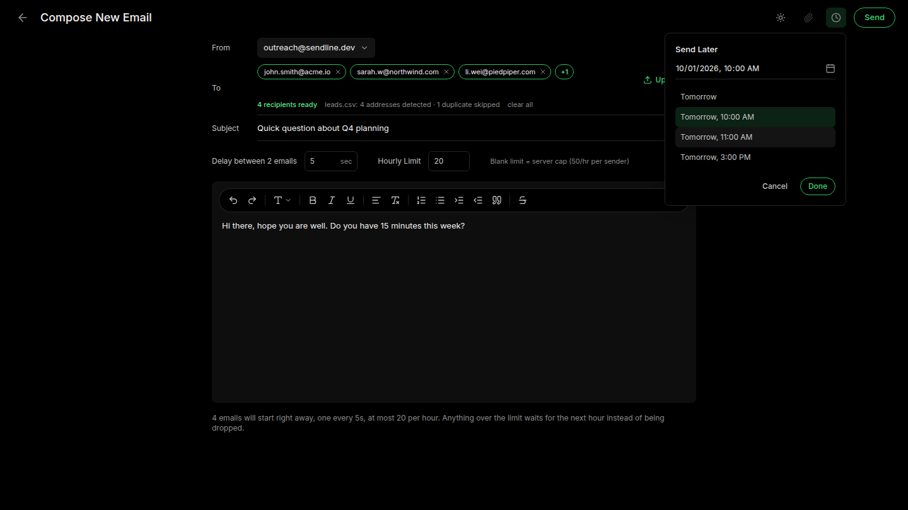 |
| Account menu: Slack connected, queue monitor, logout | 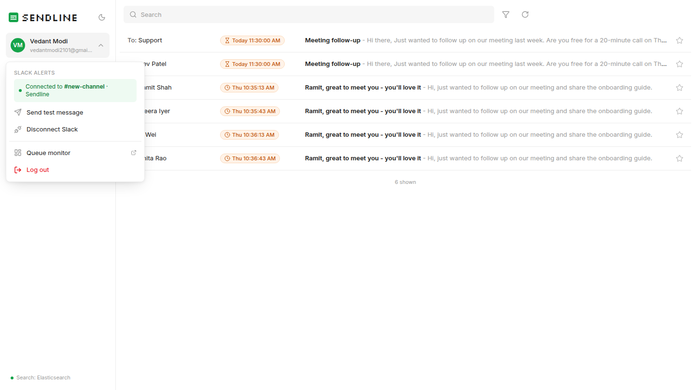 | 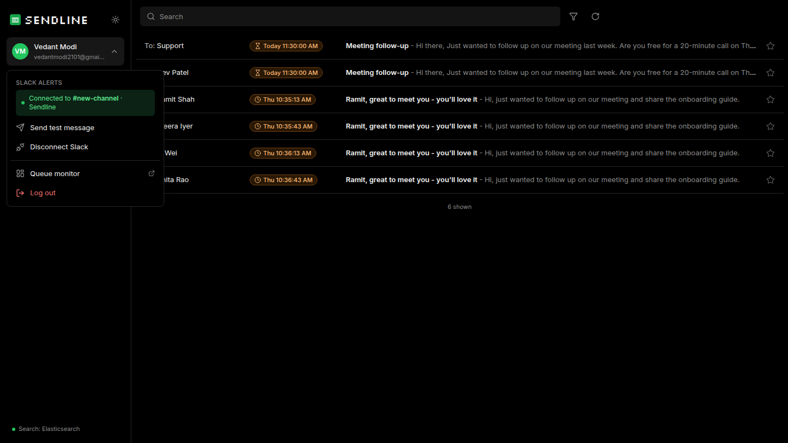 |
| Search (Elasticsearch) | 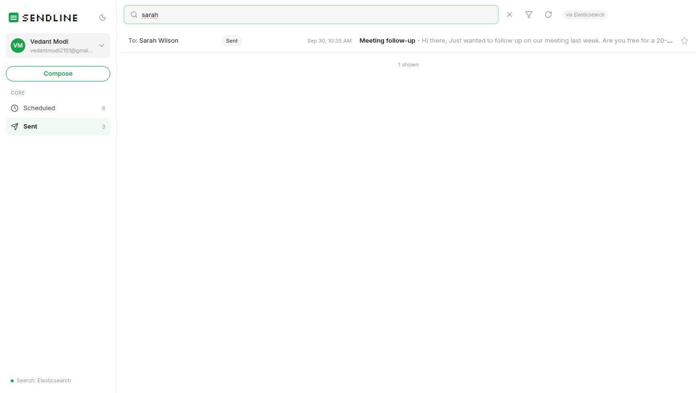 | 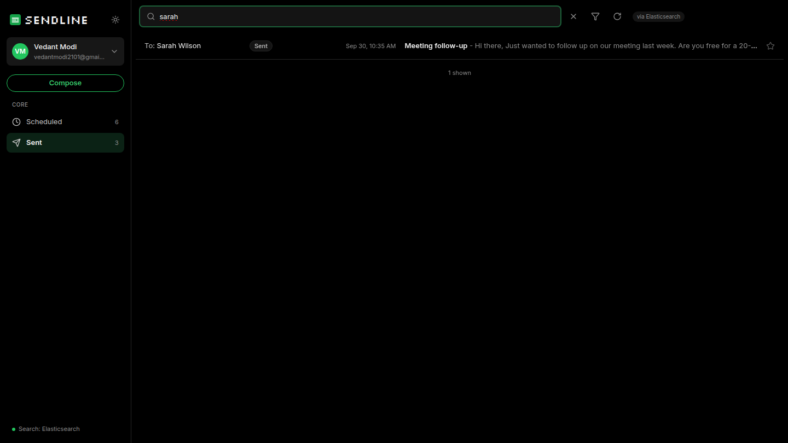 |
| Live BullMQ dashboard (`/admin/queues`) | 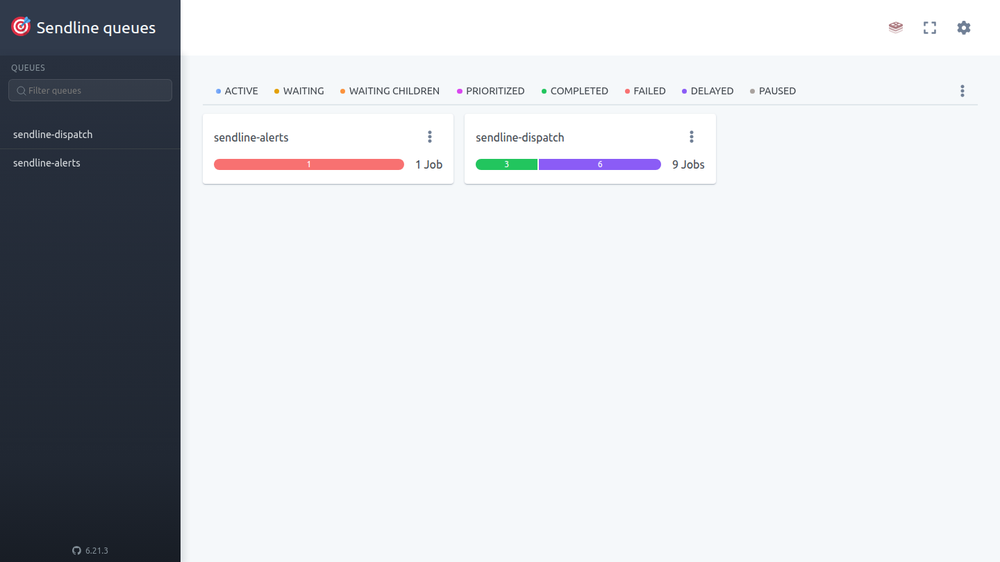 | |

---

## Run it locally

**Prerequisites:** Node 20+, Docker Desktop.

```bash
# 1) Infrastructure: Postgres :5433, Redis :6380 (AOF on), Elasticsearch :9200
docker compose up -d

# 2) API + worker  →  http://localhost:4000
cd backend
cp .env.example .env          # set SESSION_SECRET + Google/Slack keys (see below)
npm install
npm run dev                   # runs migrations, provisions Ethereal senders, starts API + worker

# 3) Dashboard  →  http://localhost:5173   (open this one)
cd ../frontend
cp .env.example .env
npm install
npm run dev
```

On first boot the API creates the tables, creates `ETHEREAL_AUTO_PROVISION` Ethereal inboxes (their passwords are stored encrypted), creates the Elasticsearch index, and re-queues any pending emails.

**Run API and workers as separate processes** (for scaling or the restart demo):

```bash
npm run dev:api        # HTTP only
npm run dev:worker     # worker only, start as many as you like
```

**Everything in Docker:** `docker compose --profile app up -d --build` → http://localhost:4000 (the API also serves the built dashboard).

### Ethereal Email

You don't need an account. By default the service calls `nodemailer.createTestAccount()` on first boot. To use inboxes you already have, create them at https://ethereal.email/create and list them:

```
ETHEREAL_ACCOUNTS=first@ethereal.email:password1,second@ethereal.email:password2
```

Each sent email stores its Ethereal preview URL. Open an email in **Sent** and click **Open the delivered message in Ethereal**.

### Google login (real OAuth)

1. https://console.cloud.google.com → APIs & Services → Credentials → **Create OAuth client ID** → *Web application*.
2. Authorised redirect URI: `http://localhost:5173/auth/google/callback` (in general, `${APP_URL}/auth/google/callback`).
3. Put the client ID and secret into `GOOGLE_CLIENT_ID` / `GOOGLE_CLIENT_SECRET`. While the consent screen is in *Testing*, add your Google account as a test user.

### Slack (real OAuth, per user)

1. https://api.slack.com/apps → **Create New App** → *From scratch*.
2. **OAuth & Permissions** → Bot token scope `incoming-webhook`. Redirect URL: `${APP_URL}/api/integrations/slack/callback`.
   Slack only accepts **https** redirect URLs, so for local use run `ngrok http 5173`, set `APP_URL` to the ngrok URL, and open the app through it (also add that URL's `/auth/google/callback` to Google).
3. Put the keys into `SLACK_CLIENT_ID` / `SLACK_CLIENT_SECRET`.
4. In the dashboard, open the account menu (top left), click **Connect Slack**, and choose a channel. Use **Send test message** to check it works.

### Environment variables (`backend/.env`)

| Variable | Default | Purpose |
|---|---|---|
| `APP_URL` | `http://localhost:5173` | Origin the browser uses. OAuth redirect URIs are built from it. |
| `SESSION_SECRET` | — | Signs session/OAuth-state tokens and derives the at-rest encryption key. |
| `DATABASE_URL` / `REDIS_URL` / `ELASTICSEARCH_URL` | compose ports | Data stores. |
| `WORKER_CONCURRENCY` | `5` | Jobs processed in parallel per worker process. |
| `MIN_SEND_GAP_MS` | `2000` | Minimum gap between two sends **from the same sender**. |
| `MAX_EMAILS_PER_HOUR_PER_SENDER` | `50` | Server-side hourly ceiling per sender. The compose form can only set a lower value. |
| `SEND_MAX_ATTEMPTS` | `3` | SMTP attempts before an email is marked `failed` (exponential backoff). |
| `RATE_WINDOW_MS` | `3600000` | Length of the rate window. Set it to e.g. `120000` to demo a limit rollover in 2 minutes. |
| `ETHEREAL_ACCOUNTS` / `ETHEREAL_AUTO_PROVISION` | `""` / `3` | Sender pool. |

---

## Architecture

### Scheduling (no cron)

`POST /api/campaigns` validates and de-duplicates the recipients, then plans each send time as `start + i × delay`. In **one Postgres transaction** it writes the campaign and one `emails` row per recipient. After that it calls `addBulk` to create one **BullMQ delayed job** per row, with `jobId = email.id`. There are no cron jobs, no polling loops and no repeatable jobs. Every email wakes up exactly once, at its own time.

### Persistence and restarts

- **Postgres records every email first; Redis is only the alarm clock.** Redis runs with AOF, so delayed jobs survive a Redis restart.
- **On every worker boot, a reconciler** walks the pending rows in send order and re-enqueues any row whose job is missing (for example after Redis lost its data). A job whose id already exists is a no-op in BullMQ, so it is safe to run on every boot and from several instances.
- **Graceful stop:** on `SIGTERM`/`SIGINT` the worker finishes the SMTP calls in progress and then exits. Past-due emails are sent when the service comes back, still paced and still counted against the limit, and never from the start.
- **Crash during an SMTP call (`kill -9`):** a write-ahead *flight marker* in Redis records `started`, then `delivered`, around each send. Recovery handles three cases:
  - `delivered` but the DB row was never updated: the row is marked sent.
  - `started` with no `delivered`: the outcome is unknown, so the email is marked `failed` with a clear reason instead of being sent again. This is an at-most-once choice.
  - No marker: SMTP never started, so the email is safely re-queued.

### Idempotency (never send twice)

1. **Enqueue:** `jobId = email.id`. Re-adding the same email can never create a second job.
2. **Claim:** `UPDATE emails SET status='sending' WHERE id=$1 AND status IN ('scheduled','deferred')`. Only one worker, in any process, can win it.
3. **Terminal states** (`sent`, `failed`, `cancelled`) short-circuit the processor.
4. **API retries:** the compose screen sends an `Idempotency-Key`. Double clicks and client retries return the original campaign (`UNIQUE (user_id, client_key)`).
5. **Upload duplicates:** `UNIQUE (campaign_id, recipient)`.

### Rate limiting, pacing and concurrency: the slot ledger

The ledger is a single Redis Lua script (`backend/src/modules/throttle/slot-ledger.lua`), so each decision is **atomic across all workers and all instances**:

| Rule | Mechanism |
|---|---|
| **Pacing**: ≥ `max(MIN_SEND_GAP_MS, campaign delay)` between sends from one sender | Per-sender *cursor*. Each reservation takes `max(now, cursor)` and moves the cursor forward by the gap. |
| **Hourly quota**: per sender (`MAX_EMAILS_PER_HOUR_PER_SENDER`) **and** per campaign (compose-form "Hourly Limit") | Redis counters keyed `sender + window` and `campaign + window`, with TTLs. |
| **When a window is full** | The email is **not dropped or failed**. It books the next window that has room and is parked at `windowStart + ordinal`. The ordinal keeps the original order. It is shown as **Deferred** with its real ETA. |
| **Alert** | The first deferral per sender per real window enqueues **one** Slack alert, however large the burst. |

When the ledger says "not yet", the worker calls `job.moveToDelayed(slot)` and throws `DelayedError`. That doesn't use up a retry attempt and doesn't block a concurrency slot.

**Concurrency:** `WORKER_CONCURRENCY` parallel jobs per process, and any number of processes. Parallelism helps across senders. Within one sender, pacing is exact, because the Lua cursor serialises it. A test with two worker processes and 30 emails on one sender measured dispatch starts **297–311 ms apart** with a 300 ms gap, 0 duplicates, and both processes sending.

### Behaviour under load (1000+ emails at the same moment)

- **API:** the rows are inserted with one `INSERT … SELECT unnest(…)` and the jobs are added in batches of 500. Scheduling 500 emails took about 250 ms locally.
- **Worker:** jobs wake in order and the ledger hands out slots:
  - the first `cap` emails of the window go out, spaced by the gap;
  - the rest roll forward window by window, in order;
  - Slack gets one message;
  - the dashboard shows each deferred email's real send time.
- Tested with 1000 emails across 2 senders, cap 5 and a 20 s window: 5 sent per sender per window, the other 990 deferred evenly over 100 windows, **2 Slack alerts** (one per sender), 0 duplicates.
- Try it: `npm run load-test -- --user you@gmail.com --count 1000 --sender 1`

**Default delay choice:** at least **2 seconds between sends per sender** (`MIN_SEND_GAP_MS=2000`). A campaign's "Delay between 2 emails" can make the gap longer, never shorter.

### Slack notifications

- **OAuth v2 with the `incoming-webhook` scope:** the user picks a channel and the webhook URL is stored **encrypted (AES-256-GCM)** per user.
- **Alerts run on their own BullMQ queue** with retries, so a slow Slack call never delays email sending.
- **Not connected:** the alert is a silent no-op, with no crash.
- **Connect later:** the webhook is read when the alert is sent, so alerts start working without a redeploy.
- **Revoked (403/404/410 from Slack):** the stored connection is removed automatically.

### Search (Elasticsearch)

- **Indexing:** every email is indexed when it is created and again on every status change. The index is rebuilt from Postgres if it is ever missing.
- **Matching:**
  - Subject and body match with typo tolerance.
  - Addresses match exactly or by substring. `lead7` never matches `lead8`.
  - Search-as-you-type works on prefixes.
- **Fallback:** if Elasticsearch is down, sending keeps working and search falls back to Postgres `ILIKE`. The UI shows which engine answered.

### Queue dashboard

Bull Board is at **`/admin/queues`**. It shows the `sendline-dispatch` and `sendline-alerts` queues live and sits behind the same Google session. Open it from the account menu → **Queue monitor**.

---

## API

| Method | Path | Notes |
|---|---|---|
| GET | `/auth/google` → `/auth/google/callback` | OIDC code flow + PKCE, ID token verified against Google JWKS |
| POST | `/auth/logout` | |
| GET | `/api/me` | user + Slack status |
| GET | `/api/senders` | sender pool + current-window usage |
| POST | `/api/campaigns` | `{ senderId, subject, bodyHtml, recipients[], startAt?, delaySeconds, hourlyLimit? }`, optional `Idempotency-Key` header |
| GET | `/api/emails?folder=scheduled\|sent&q=&status=&cursor=` | keyset-paginated; `q` → Elasticsearch |
| GET | `/api/emails/:id` · POST `/api/emails/:id/cancel` | detail / cancel before sending |
| GET | `/api/overview` | folder counts, queue counts, search health |
| GET/DELETE | `/api/integrations/slack` · GET `…/install` · `…/callback` · POST `…/test` | Slack connect / disconnect / test |
| GET | `/healthz` | Postgres / Redis / Elasticsearch status |

## Features implemented

**Backend**

- [x] Express + TypeScript. Zod-validated config: nothing is hardcoded.
- [x] BullMQ delayed jobs (no cron), Postgres storage, forward-only SQL migrations.
- [x] Multiple Ethereal senders: auto-provisioned or listed, passwords encrypted at rest.
- [x] Persistence across restarts:
  - Redis AOF;
  - boot reconciler;
  - graceful drain;
  - crash classification through flight markers.
- [x] Idempotency at every layer: job id, DB claim, API `Idempotency-Key`, and unique recipients.
- [x] Configurable worker concurrency, safe across processes.
- [x] Minimum delay between sends (pacing).
- [x] Hourly limits per sender and per campaign:
  - Redis Lua counters;
  - reschedules to the next window in order, never drops.
- [x] Slack OAuth plus a live alert when a limit is hit; disconnect and reconnect work without a redeploy.
- [x] Elasticsearch indexing and search, with a Postgres fallback.
- [x] Bull Board live queue dashboard.
- [x] Tests for the ledger (against real Redis) and for the recipient, planner, sanitiser and crypto helpers: `npm test`.

**Frontend**

- [x] Google login (real OAuth). The header shows name, email and avatar, with logout.
- [x] Dashboard with **Scheduled** and **Sent** tabs, live counts and auto-refresh.
- [x] Compose:
  - From (sender) and To chips;
  - **CSV/TXT upload** that reports how many addresses were detected, duplicates and invalid entries;
  - subject and rich-text body;
  - delay and hourly limit;
  - **Send Later** picker with presets.
- [x] Tables:
  - Scheduled shows email, subject, time and status;
  - Sent shows email, subject, sent time and sent/failed;
  - search, status filter, keyset "Load more".
- [x] Email detail view: delivery metadata, Ethereal preview link, and cancel for pending emails.
- [x] Loading skeletons, empty states, error states with retry, toasts, inline validation.
- [x] Light and **dark (black) theme**: toggle in the sidebar, login, compose and detail views. It follows the OS setting by default and remembers your choice.
- [x] Reusable UI kit (`components/ui`), typed API layer (`types/api.ts`, `lib/api.ts`), feature-based folders.

## Assumptions and trade-offs

- **Fixed rate windows, not sliding.** Aligned windows are simple, atomic and easy to reason about. The cost is that a burst can straddle a window boundary (up to `2 × cap` inside any 60 minutes that crosses one).
- **At-most-once when unsure.** An email whose worker died *during* the SMTP conversation is marked failed rather than sent again. Duplicates are worse than a visible failure for cold outreach.
- **Hourly limit placement.** The runtime ledger enforces the hourly limit, not the planner. So the "scheduled for" time can move later, and the email shows as **Deferred** with its new ETA. This keeps limits correct across campaigns that share a sender.
- **Email/password fields** from the design are rendered, but sign-in is Google-only, as the brief requires.
- **Stars and attachments.** Stars are stored in the browser only. Attachments are not supported for campaigns: the icon is shown but disabled.
- **One Slack channel per user**, through an incoming webhook.
- **Slack alert timing.** Alerts fire when the first email is deferred because a window is full, and at most once per sender per window.

## Project layout

```
backend/
  migrations/            SQL schema (applied on boot, advisory-locked)
  src/config/env.ts      validated configuration
  src/modules/
    auth/                Google OIDC + PKCE, sessions
    campaigns/           validation, planning, sanitising, scheduling service
    dispatch/            queues, processor, worker, crash markers
    throttle/            slot-ledger.lua + wrapper
    recovery/            boot reconciler
    search/              Elasticsearch index + query
    slack/               OAuth, notifier
    senders/             Ethereal provisioning + SMTP transports
  scripts/               load-test, add-smtp-sender
  test/                  node:test suites
frontend/src/
  components/ui/         Button, Field, Popover, StatusPill, Toast, States, Avatar
  components/layout/     AppShell, Sidebar, UserMenu, Logo
  features/              auth, mailbox, detail, compose
  hooks/ lib/ types/     data hooks, API client, formatters, shared types
```
